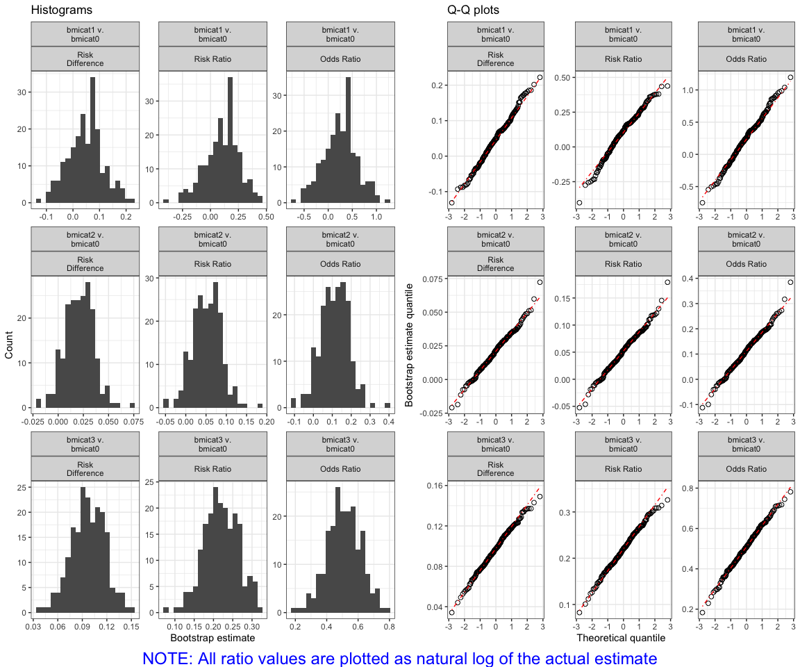

<!-- README.md is generated from README.Rmd. Please edit that file -->

# riskCommunicator

<!-- badges: start -->

<!-- badges: end -->

An R package for estimating risk differences and relative risk measures.

The `riskCommunicator` package facilitates the estimation of common
epidemiological effect measures that are relevant to public health, but
that are often not trivial to obtain from common regression models, like
logistic regression. In particular, `riskCommunicator` estimates risk
and rate differences, in addition to risk and rate ratios. The package
estimates these effects using g-computation with the appropriate
parametric model depending on the outcome (logistic regression for
binary outcomes, Poisson regression for rate or count outcomes, and
linear regression for continuous outcomes). Therefore, the package can
handle binary, rate, count, and continuous outcomes and allows for
dichotomous, categorical (\>2 categories), or continuous exposure
variables. Additional features include estimation of effects stratified
by subgroup and adjustment of standard errors for clustering. Confidence
intervals are constructed by bootstrap at the individual or cluster
level, as appropriate.

This package operationalizes g-computation, which has not been widely
adopted due to computational complexity, in an easy-to-use
implementation tool to increase the reporting of more interpretable
epidemiological results. To make the package accessible to a broad range
of health researchers, our goal was to design a function that was as
straightforward as the standard logistic regression functions in R
(e.g. `glm`) and that would require little to no expertise in causal
inference methods or advanced coding.

## Installation

Soon, you will be able to install the released version of
`riskCommunicator` from [CRAN](https://CRAN.R-project.org) with:

``` r
install.packages("riskCommunicator")
```

For now, the development version is available as a source package
through [GitHub](https://github.com/). Installation requires the ability
to compile R packages. This means that R and the R tool-chain must be
installed, which requires the Xcode command-line tools on Mac and Rtools
on Windows.

The easiest source installation method uses the devtools package:

``` r
# install.packages("devtools")
devtools::install_github("jgrembi/riskCommunicator")
```

## Other Resources

Bugs and difficulties in using `riskCommunicator` are welcome on the
issue tracker.

Planned feature improvements are also publicly catalogued on the
“Issues” page for `riskCommunicator`:
<https://github.com/jgrembi/riskCommunicator/issues>

## Example

This is a basic example which shows you how to answer the following
question: What is the effect of obesity on the 24-year risk of
cardiovascular disease or death due to any cause?

In this example, we specify obesity as a categorical variable (`bmicat`
coding: 0 = normal weight; 1=underweight; 2=overweight; 3=obese)

``` r
library(riskCommunicator)
library(ggplot2)
library(tidyverse)
#> ── Attaching packages ──────────────────────────────────────────────────────── tidyverse 1.3.0 ──
#> ✓ tibble  3.0.1     ✓ dplyr   1.0.0
#> ✓ tidyr   1.1.0     ✓ stringr 1.4.0
#> ✓ readr   1.3.1     ✓ forcats 0.5.0
#> ✓ purrr   0.3.4
#> ── Conflicts ─────────────────────────────────────────────────────────── tidyverse_conflicts() ──
#> x dplyr::filter() masks stats::filter()
#> x dplyr::lag()    masks stats::lag()
## basic example code
data(cvdd)
set.seed(345)
bmi.results <- gComp(data = cvdd, Y = "cvd_dth", X = "bmicat", Z = c("AGE", "SEX", "DIABETES", "CURSMOKE", "PREVHYP"), outcome.type = "binary", R = 200)
bmi.results
#> Formula: 
#> cvd_dth ~ bmicat + AGE + SEX + DIABETES + CURSMOKE + PREVHYP 
#> 
#> Parameter estimates: 
#>                             bmicat1_v._bmicat0 Estimate (95% CI)
#> Risk Difference                            0.054 (-0.114, 0.204)
#> Risk Ratio                                  1.099 (0.790, 1.375)
#> Odds Ratio                                  1.248 (0.631, 2.506)
#> Number needed to treat/harm                               18.462
#>                             bmicat2_v._bmicat0 Estimate (95% CI)
#> Risk Difference                            0.023 (-0.007, 0.064)
#> Risk Ratio                                  1.042 (0.989, 1.120)
#> Odds Ratio                                  1.097 (0.973, 1.297)
#> Number needed to treat/harm                               43.685
#>                             bmicat3_v._bmicat0 Estimate (95% CI)
#> Risk Difference                             0.116 (0.072, 0.166)
#> Risk Ratio                                  1.211 (1.129, 1.318)
#> Odds Ratio                                  1.628 (1.348, 2.037)
#> Number needed to treat/harm                                8.642
```

The results from the g-computation show the estimated risk difference
and ratio, in addition to other information. From these results, we see
that obese persons have an 11.6% (95% CI: 7.2, 16.6) increase in 24-year
risk of cardiovascular disease or death compared to normal weight
persons. Underweight persons also have increased risk, more so than
overweight persons. Not surprisingly, the estimate comparing underweight
to normal weight persons is imprecise given the few people in the
dataset who were underweight.

You can verify that the parameter estimates from the bootstraps are
normally distributed:

``` r
plot(bmi.results)
```



You can also easily plot the outcome estimates:

``` r
ggplot(bmi.results$results.df %>% 
         filter(Parameter %in% c("Risk Difference", "Risk Ratio"))
) + 
  geom_pointrange(aes(x = Comparison, 
                      y = Estimate, 
                      ymin = `2.5% CL`, 
                      ymax = `97.5% CL`, 
                      color = Comparison), 
                  shape = 2
  ) + 
  coord_flip() + 
  facet_wrap(~Parameter, scale = "free") + 
  theme_bw() + 
  theme(legend.position = "none")
```


